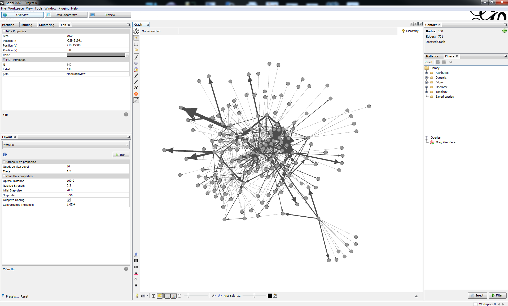

js-parser
=========

Parses your JavaScript, then dumps it into a graphml, where it can be:

* Imported into a graph database
* Queried by [Gremlin](https://github.com/tinkerpop/gremlin)
* Rendered with [Gephi](http://gephi.github.io/)

Usage
-----
java -jar js-parser.jar /path/to/js/root /path/to/output.graphml

License
-------
MIT License. Refer to LICENSE file in root.
